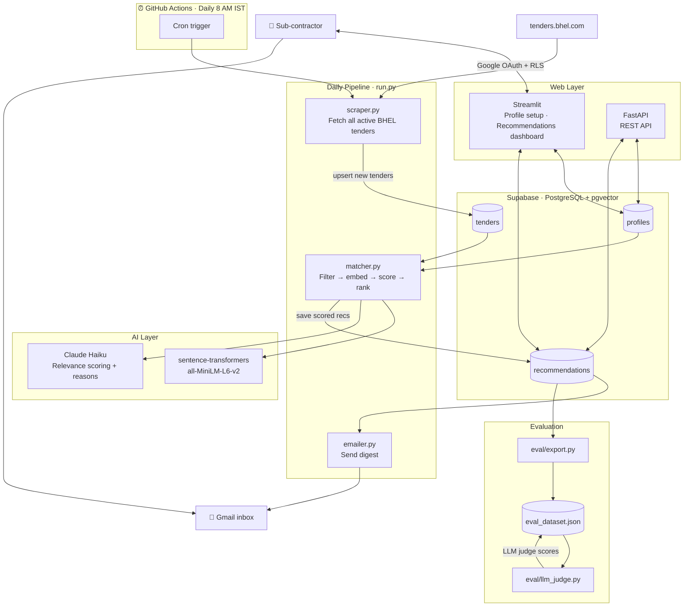

# BHEL Tender Recommendations

BHEL (Bharat Heavy Electricals Limited) posts hundreds of tenders on the GeM portal, but only emails sub-contractors about a handful of them. Most relevant opportunities go unnoticed.

This project fixes that. It scrapes all active BHEL tenders daily, matches them against a sub-contractor's work scope using AI, and delivers a personalised digest every morning.

**Live app:** https://nandinikodali-tenderrecommendations.hf.space

---

## How it works

A GitHub Actions cron job runs every morning at 8 AM IST. It scrapes tenders.bhel.com, stores new tenders in Supabase, and then for each sub-contractor profile:

1. **Hard filter** — drops tenders outside the user's preferred BHEL locations, tender types, and value range. No API cost.
2. **Semantic search** — embeds the remaining tenders with `sentence-transformers` and does a pgvector similarity search against the user's work scope.
3. **AI scoring** — Claude scores each shortlisted tender and writes a plain-English reason for the match.
4. **Feedback boost** — if the user has previously marked tenders as helpful, their embeddings are blended into the query vector. The more feedback, the stronger the signal.
5. **Email digest** — ranked list of relevant tenders lands in their inbox.

The scraper is profile-agnostic — it fetches broadly and stores everything. Filters live in the profile, so adding a new user later requires zero changes to the pipeline.

---

## Architecture



---

## What I built

**Phase 1 — core pipeline**
- Scraper with early-stop on already-seen tenders
- Supabase schema (tenders, profiles, recommendations)
- Claude Haiku batch scoring with match reasons
- Gmail SMTP digest
- GitHub Actions cron workflow
- Streamlit profile setup + recommendations dashboard

**Phase 2 — portfolio enhancements**

| Feature | What it shows |
|---|---|
| RAG pipeline (pgvector + sentence-transformers) | Vector search, embeddings, retrieval-augmented generation |
| Feedback loop with dynamic vector boosting | Adaptive AI — user signal improves future recommendations |
| Multi-agent architecture (Claude tool use) | Agentic AI — orchestrator drives scraper, analyst, and editor agents |
| FastAPI backend | Clean API layer separating backend from UI |
| Supabase Auth + Row Level Security | Multi-tenant auth, each user only sees their own data |

---

## Tech stack

| Layer | Tool |
|---|---|
| Web app | Streamlit, hosted on Hugging Face Spaces |
| REST API | FastAPI |
| Database + auth | Supabase (PostgreSQL, pgvector, Supabase Auth) |
| Embeddings | sentence-transformers (all-MiniLM-L6-v2) |
| AI scoring + agents | Claude (Anthropic API) |
| Email | Gmail SMTP |
| Scheduling | GitHub Actions cron |

---

## Running locally

```bash
git clone https://github.com/NandiniKodali988/TenderRecommendations.git
cd TenderRecommendations
python -m venv venv && source venv/bin/activate
pip install -r requirements.txt
cp .env.example .env  # fill in your credentials
streamlit run app.py
```

To run the pipeline manually:
```bash
python run.py
```

To run the API:
```bash
uvicorn api:app --reload
```

---

## Credentials needed

See `.env.example`. You'll need a Supabase project, an Anthropic API key, and a Gmail app password.