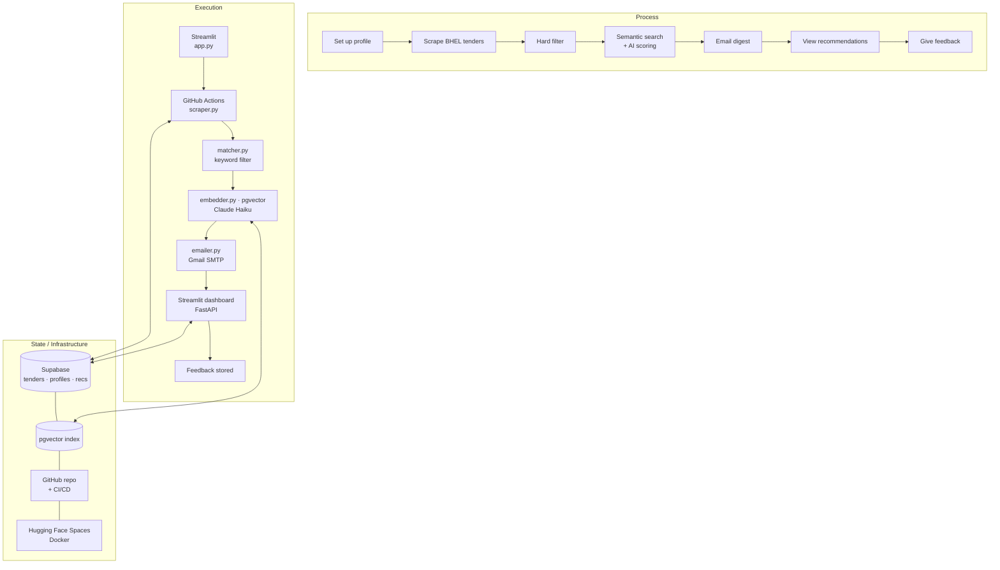

# BHEL Tender Recommendations

BHEL (Bharat Heavy Electricals Limited) posts hundreds of tenders on the GeM portal, but only emails sub-contractors about a handful of them. Most relevant opportunities go unnoticed.

This project fixes that. It scrapes all active BHEL tenders daily, matches them against a sub-contractor's work scope using AI, and delivers a personalised digest every morning.

**Live app:** https://nandinikodali-tenderrecommendations.hf.space

---

## How it works

A GitHub Actions cron job runs every morning at 8 AM IST. It scrapes tenders.bhel.com, stores new tenders in Supabase, and then for each sub-contractor profile:

1. **Hard filter** drops tenders outside the user's preferred BHEL locations, tender types, and value range. No API cost.
2. **Semantic search** embeds the remaining tenders with `sentence-transformers` and does a pgvector similarity search against the user's work scope.
3. **AI scoring** has Claude score each shortlisted tender and write a plain-English reason for the match.
4. **Feedback boost** blends liked tenders into the query vector if the user has given thumbs up before. The more feedback, the stronger the signal.
5. **Email digest** sends a ranked list of relevant tenders to their inbox.

The scraper is profile-agnostic. It fetches broadly and stores everything. Filters live in the profile, so adding a new user later requires zero changes to the pipeline.

---

## Architecture



---

## What's inside

The scraper runs on a schedule and is completely separate from the matching logic. It pulls all active BHEL tenders and stores them in Supabase with no filters and no assumptions about who's using the system. Adding a new sub-contractor later requires zero changes to the scraper. Their preferences live in their profile and get applied at match time.

The matching pipeline goes through a few stages. First it drops tenders that obviously don't fit: wrong BHEL unit, wrong tender type, excluded keywords. That's cheap and fast. Then it embeds the remaining tenders and does a vector similarity search against the user's work scope description using pgvector. Claude then looks at the top candidates and writes a plain-English reason for each match. If the user has given thumbs up feedback before, those liked tenders get blended into the query vector, so the recommendations get more personalised over time.

The web app is built in Streamlit and sits on top of a FastAPI backend. Authentication is handled by Supabase Auth with Google login, and Row Level Security makes sure each user only ever sees their own data.

There's also a small evaluation setup in the `eval/` folder. It exports recommendations and human feedback to JSON, then runs an independent LLM judge that re-scores each tender without seeing the original Claude score. Useful for checking whether the recommendations are actually good.

---

## Tech stack

| | |
|---|---|
| Web app | Streamlit on Hugging Face Spaces |
| REST API | FastAPI |
| Database + auth | Supabase (PostgreSQL + pgvector + Supabase Auth) |
| Embeddings | sentence-transformers (all-MiniLM-L6-v2) |
| AI scoring | Claude Haiku (Anthropic) |
| Agents | Claude tool use (orchestrator, scraper, analyst, editor) |
| Email | Gmail SMTP |
| Scheduling | GitHub Actions cron |
| Tests | pytest, 19 unit tests, CI on every push |

---

## Running locally

```bash
git clone https://github.com/NandiniKodali988/TenderRecommendations.git
cd TenderRecommendations
python -m venv venv && source venv/bin/activate
pip install -r requirements.txt
cp .env.example .env  # fill in your credentials
streamlit run app.py
```

To run the pipeline manually:
```bash
python run.py
```

To run the API:
```bash
uvicorn api:app --reload
```

To run tests:
```bash
pip install -r requirements-dev.txt
pytest tests/ -v
```

---

## Credentials

See `.env.example`. You'll need a Supabase project, an Anthropic API key, and a Gmail app password.